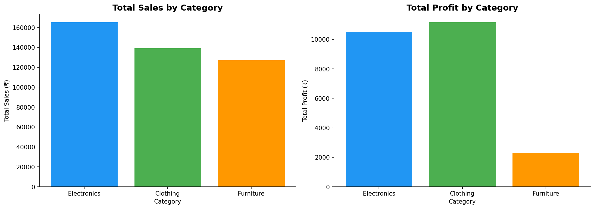
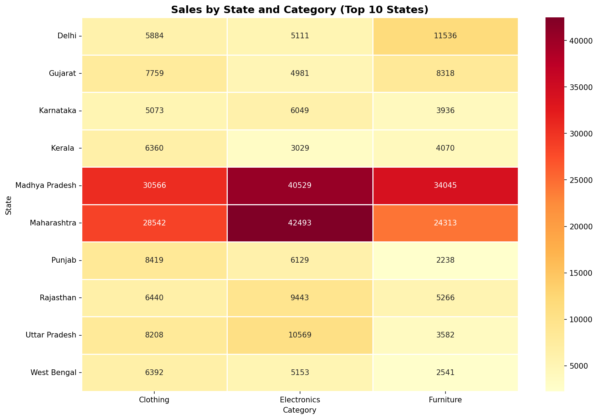
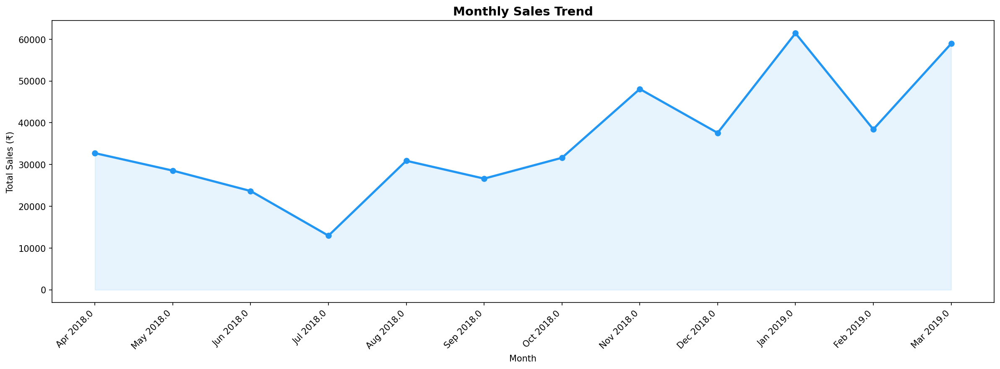

# E-Commerce Sales Analysis — India 2018-2019

## Project Overview
End-to-end analysis of 1,500+ e-commerce orders across 28 Indian states 
using Python and Google Data Studio.

## Tools Used
Python, Pandas, Matplotlib, Seaborn, Google Data Studio

## Key Findings
- Electronics is the highest revenue category (38.3% of total sales)
- Printers and Bookcases are top selling sub-categories
- Total Revenue: ₹4,31,502 | Total Profit: ₹23,955

## Dashboard
[View Live Dashboard](https://datastudio.google.com/reporting/b7e71c39-c2c7-4331-a08b-2cdd5ab5319c)

## Charts

